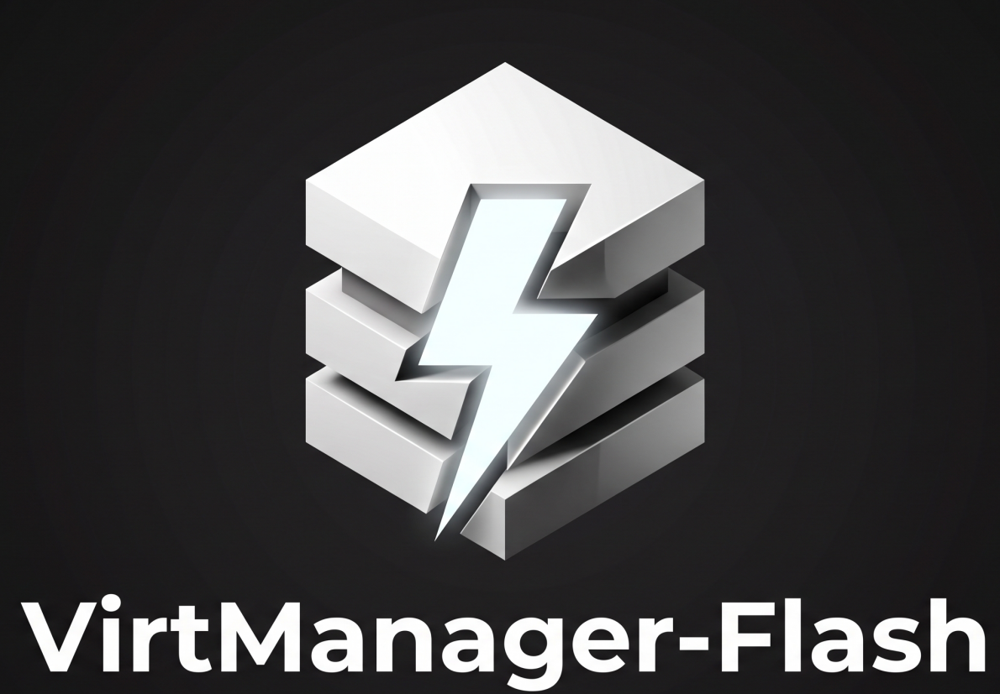

# VirtManager-Flash

<p align="center">
  
</p>

<p align="center">
  <a href="#english">English</a> | <a href="#繁體中文">繁體中文</a>
</p>

---

<a name="english"></a>
## English

> A modern, lightweight, and blazing-fast KVM virtualization desktop application, serving as a modern and lightweight alternative/complement to **virt-manager**, powered by the **Tauri** framework.

### 🌟 Introduction

**VirtManager-Flash** aims to simplify the complexity of `virt-manager`, combining the raw performance and security of Rust with a premium, modern, and fluid user interface built with web technologies, all packaged seamlessly using Tauri.

### 🚀 Key Features

- **KVM Native Management**: Seamlessly manage **KVM** (Kernel-based Virtual Machines) with a clean, fast interface.
- **Modern User Experience**: A beautiful, fluid interface with dark mode, interactive monitoring charts, and micro-animations.
- **Lightweight & Fast**: Extremely low resource footprint compared to Electron-based alternatives, thanks to Tauri and Rust.
- **Remote & Local Connections**: Manage hypervisors locally or over secure SSH tunnels.

### 🛠️ Tech Stack

- **Backend**: Rust (Tauri Core, `libvirt-rs`)
- **Frontend**: React (TypeScript) + Vite, Vanilla CSS
- **Communication**: Tauri IPC (Inter-Process Communication)

### 📋 Getting Started

#### Prerequisites

To build and run VirtManager-Flash locally, you need the following dependencies installed on your system:

##### Build Dependencies (Required for compiling from source)
```bash
# Ubuntu / Debian
sudo apt update
sudo apt install -y libvirt-dev pkg-config build-essential curl wget libssl-dev libgtk-3-dev libwebkit2gtk-4.1-dev librsvg2-dev
```

##### Runtime Dependencies (Required only for running the application)
```bash
# Ubuntu / Debian
sudo apt update
sudo apt install -y libvirt0 libgtk-3-0 libwebkit2gtk-4.1-0 librsvg2-common
```

##### Toolchain Management (`mise`)
This project uses [mise](https://mise.jdx.dev/) to manage the development toolchains (Node.js, Bun, and Rust).

Make sure you have `mise` installed, then run:
```bash
mise install
```

This will automatically install the correct versions specified in `mise.toml`.

#### Installation, Running & Building

```bash
# Run in development mode (automatically installs dependencies)
mise run dev

# Build the application (all bundles)
mise run build

# Build a specific package format (e.g. if AppImage bundler fails)
mise run build -- --bundles deb
```

#### 💻 Recommended IDE Setup

- [VS Code](https://code.visualstudio.com/) + [Tauri](https://marketplace.visualstudio.com/items?itemName=tauri-apps.tauri-vscode) + [rust-analyzer](https://marketplace.visualstudio.com/items?itemName=rust-lang.rust-analyzer)

#### 📄 License

This project is licensed under the MIT License - see the [LICENSE](LICENSE) file for details.

---

<a name="繁體中文"></a>
## 繁體中文

> 基於 **Tauri** 框架打造，作為 **virt-manager** 現代化與輕量化互補/替代選擇的 **KVM** 虛擬化管理桌面應用程式。

### 🌟 簡介

**VirtManager-Flash** 旨在**簡化 `virt-manager` 的複雜度**，結合 Rust 的極致效能與安全性，搭配以網頁技術建構的精美、現代化且流暢的用戶介面，並透過 Tauri 進行無縫封裝，為您帶來更簡單、直覺的 KVM 虛擬化管理體驗。

### 🚀 核心特性

- **KVM 原生管理**：透過簡潔、快速的介面無縫管理 **KVM** (核心虛擬機)。
- **現代化使用者體驗**：擁有深色模式、互動式監控圖表和細微動畫的精美、流暢介面。
- **輕量與極速**：得益於 Tauri 和 Rust，與基於 Electron 的替代方案相比，資源占用極低。
- **遠端與本地連線**：透過本地或安全的 SSH 通道管理虛擬化主機。

### 🛠️ 技術棧

- **後端**：Rust (Tauri Core, `libvirt-rs`)
- **前端**：React (TypeScript) + Vite, Vanilla CSS
- **通訊方式**：Tauri IPC (進程間通訊)

### 📋 開始使用

#### 前提條件

若要在本地建置和執行 VirtManager-Flash，您需要在系統上安裝以下依賴項目：

##### 建置依賴 (從原始碼編譯時需要)
```bash
# Ubuntu / Debian
sudo apt update
sudo apt install -y libvirt-dev pkg-config build-essential curl wget libssl-dev libgtk-3-dev libwebkit2gtk-4.1-dev librsvg2-dev
```

##### 執行依賴 (僅執行已編譯好的應用程式時需要)
```bash
# Ubuntu / Debian
sudo apt update
sudo apt install -y libvirt0 libgtk-3-0 libwebkit2gtk-4.1-0 librsvg2-common
```

##### 工具鏈管理 (`mise`)
本專案使用 [mise](https://mise.jdx.dev/) 來管理開發工具鏈 (Node.js, Bun 和 Rust)。

請確保您已安裝 `mise`，然後執行：
```bash
mise install
```

這將會自動安裝 `mise.toml` 中指定的正確版本。

#### 安裝、執行與建置

```bash
# 以開發模式執行 (會自動安裝依賴)
mise run dev

# 建置應用程式 (所有安裝包)
mise run build

# 建置特定的安裝包格式 (例如當 AppImage 打包失敗時)
mise run build -- --bundles deb
```

#### 💻 推薦的 IDE 設定

- [VS Code](https://code.visualstudio.com/) + [Tauri](https://marketplace.visualstudio.com/items?itemName=tauri-apps.tauri-vscode) + [rust-analyzer](https://marketplace.visualstudio.com/items?itemName=rust-lang.rust-analyzer)

#### 📄 授權條款

本專案採用 MIT 授權條款 - 詳見 [LICENSE](LICENSE) 檔案。
